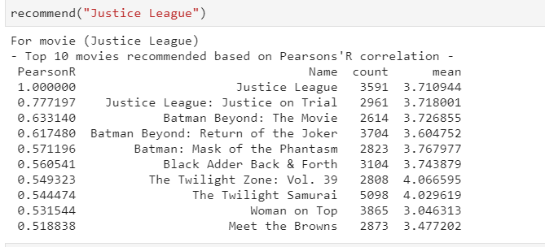
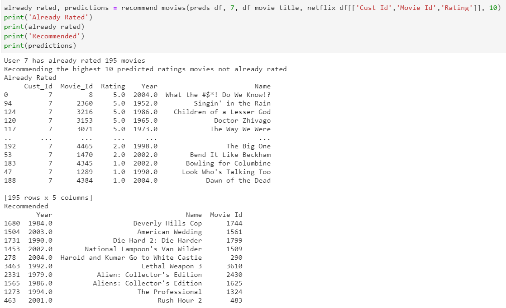

# Recommendation_engine
Recommendation engine using netflix data
In this code, Using a given movie name, engine will recommend 10 more movies which user may like according to current intrest. Here we are usng Pearson correlation to find suggetions

Using Pearson's Correlation : recommended movie based on movie name 
1. We have 2 type of data - movies (contains movie_id, Year and Name of the movie) and Customer data which contains (customer_Id, movie_Id, Rating given to particular movie)
2. Then we merge the 2 dataframes on the movieId key 
3. We then generate a pivot table with the values as the ratings, the users as the rows and the movie IDs as the columns
4. A correlation matrix is then generated that represents the correlations between movies 
5. Then the movies who is user currently watching passed to function
6. Function find the correlation of pivot table with movie name passed to function( for this we are using pandas 'corrwith')
7. The recommendation list is then sorted from highest to lowest correlation and the movies with the top 10 correlations are then recommended

Using SVD : recommended movie based on userID

The Singular Value Decomposition (SVD), a method from linear algebra is used as a collaborative filtering technique.  SVD has been generally used as a dimensionality reduction technique in machine learning. SVD is a matrix factorisation technique, which reduces the number of features of a dataset by reducing the space dimension from N-dimension to K-dimension. It uses a matrix structure where each row represents a user, and each column represents an item. The elements of this matrix are the ratings that are given to items by users.

1. We generate a demean matrix using pivot table with the values as the ratings, the users as the rows and the movie IDs as the columns
2. We find SVD of demean matrix, matrix multiplication of U, sigma nd Vt gives us all predicted movie Ids
3. Now we need to return the above result based on  highest predicted rating  and that the specified user hasn’t already rated

